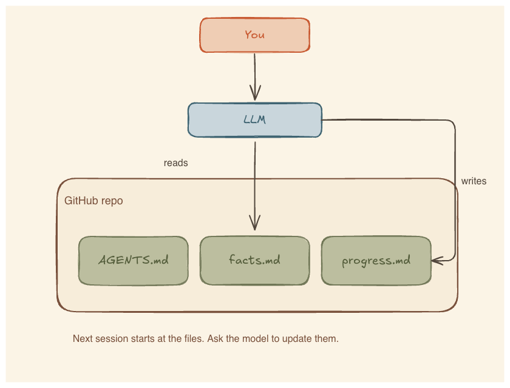

# llm-harness-example

This repository is the example that goes with the tutorial [When the LLM gets lost, ask it to update the harness](https://danieldias.dev/en/blog/ask-the-model-to-update-the-harness).

A harness, here, is the files an LLM reads before it answers. Those files record how to behave, what is true, and where the last session stopped. You keep them on GitHub so the next session, or another LLM, can read the same version.



## How it works

1. Put the rules and the current state in files in this repository.
2. Open the folder with a tool that can read those files.
3. Ask the model to work from the recorded state.
4. When a correction shows a missing rule, ask the model to update the file and show the diff.
5. Review the diff. Commit it if you accept it. The next session then starts from that version.

GitHub does not load the files into the model. The tool that opens the folder does that. GitHub stores the version you approved, with history and diffs.

## Files

| Path | Contents |
| --- | --- |
| [`AGENTS.md`](AGENTS.md) | Which folder to read for which task. |
| [`study/AGENTS.md`](study/AGENTS.md) | How to start and stop a study session. |
| [`study/progress.md`](study/progress.md) | Checkpoint for a SQL joins course, mid-course. |
| [`notes-app/AGENTS.md`](notes-app/AGENTS.md) | Treat project facts as canonical. |
| [`notes-app/facts.md`](notes-app/facts.md) | Constraints for a single-user offline notes app. |

Several tools look for `AGENTS.md`. Other names work if your tool loads them. Review the files like any other change.

## Try it

```sh
git clone https://github.com/DeVFirmino/llm-harness-example.git
cd llm-harness-example
```

Open the folder with an assistant that reads repository files.

For `study/`, start with:

```text
Read the harness and continue from the checkpoint.
```

Work the exercise. Before you close the chat:

```text
Update the checkpoint with what we verified, the open question, and the next task. Show me the diff.
```

Read `study/progress.md`. If the model marked something complete that you did not check, fix the file before you commit. Then open a new session, with this model or another one, and ask it to continue. It should start from the new checkpoint.

For `notes-app/`, ask for a plan. If the model proposes a sign-in flow or a hosted database:

```text
Read the harness again. This project is single-user and offline. Revise the plan without accounts or cloud storage.
```

If that constraint is already in `facts.md`, the model should re-read it and follow it. If the constraint is missing:

```text
Turn that correction into a rule in `facts.md` and show me the diff.
```

Read the wording. Reject anything you did not say. Commit only the update you approve. The model can change the harness. It must not turn a guess into a fact.

A correction that should survive the chat:

```text
That correction should survive this chat. Update the harness, show me the diff, and do not add facts I did not give you.
```

## License

MIT. See [LICENSE](LICENSE).
